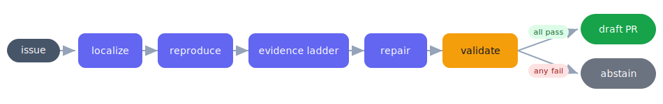

# 🤖 Go-Issue Agent

> **An agentic AI contributor for open-source Go projects** — give it a real GitHub issue and it fixes the bug end to end, *or* honestly steps back.


Give it a GitHub issue from an approved Go repository; it **localizes** the bug, **reproduces**
it, writes a **minimal patch**, **validates** that patch by compiling, vetting, and testing inside
a pinned Docker sandbox, and — only if the fix verifies — turns it into a ready-to-review
**draft pull request**. If it cannot verify a fix, it **abstains** rather than guess.



Its guiding principle is **do no harm**: the agent submits only a patch that passes its own
build + vet + reproduction, and otherwise does nothing. That makes it a disciplined fixer of
small, well-described bugs with a precisely characterized boundary — not a black box that
sometimes ships something wrong.

---

## 📺 Demo

A short walkthrough — localizing a real `validator` bug from execution, validating the fix in a
sandbox, and opening a live pull request:

▶️ **[Watch the 4-minute walkthrough](https://drive.google.com/file/d/1lKxgtsvn9nIOX0Az_ms1TlNnOQ_0Q8eY/view?usp=sharing)**

---

## ✨ What makes it different

- **🛡️ Verify-or-abstain.** Every submitted patch passed an in-sandbox reproduction that *failed
  at the base commit and passes with the change*. No unverified patch is ever emitted.
- **🔬 Execution-evidence localization.** The buggy file is found from *what the code does when
  you run the reproduction* — coverage, compiler errors, panic traces — not just from matching
  words in the issue text.
- **🔒 A gold-validation firewall.** Before the agent is scored on an instance, that instance is
  proven to be a real, reproducible bug (gold test fails at base, passes after the gold fix).
- **📏 An honest competence boundary.** The system's limits are *measured and documented*, with
  each boundary attributed to its true cause — the model, or the input — rather than hidden.
- **🔁 A closed loop.** A verified fix becomes a draft PR (with an AI-assistance disclosure)
  through a single, MCP-swappable GitHub seam.

---

## 🧠 How it works

The pipeline is **localize → reproduce → localize-for-real → repair → validate → finalize**, and
every step is built around one idea: *trust behavior, not text.*

### 1 · Localize — a first-pass shortlist

The agent pulls the key terms out of the issue and ranks the repository's files two ways: a
**lexical match** against those terms, and a **PageRank** over a map of the repo so that
structurally central files score higher. That gives a starting *shortlist* of where to look —
not a final answer.

### 2 · Reproduce — the agent writes a test that must fail

The model (Sonnet) takes the issue together with the shortlisted files and writes **its own test
that reproduces the bug** — and we *require that test to fail on the current code*. A test that
fails on the broken code is our ground truth; if the model ever writes one that passes at base,
we discard it and regenerate. Nothing downstream runs until the bug is provably reproduced.

### 3 · Localize, for real — the evidence ladder

A bug report is a *description*; the bug itself is a *behavior*. So instead of trusting the words
in the issue, the agent localizes from **what the code does when the reproduction runs** —
climbing a ladder of evidence, always using the strongest signal that actually exists and falling
to the next rung only when the one above is empty.

| Rung | Signal | Fires when… | What it pins down |
|:---:|---|---|---|
| **1** | **Compiler error** | the build fails | the exact `file:line:col` — take it and stop |
| **2** | **Panic / stack trace** | it compiles but crashes | the deepest frame *inside the repo* (stdlib frames skipped) |
| **3** | **Coverage of the reproduction** | the bug is *silent* — compiles, never crashes, just wrong | the handful of files that actually executed (≈ 8 of ≈ 40) |
| **4** | **Issue identifiers (lexical)** | always | *orders* the shortlist by how strongly the issue's terms appear |
| **5** | **PageRank centrality** | tie-break | structural importance in the repo graph |

The first two rungs *find* the file outright. **Rung 3 is the workhorse** — most real bugs are
silent: they compile cleanly and never panic, so there's no error to read, and this is exactly
where naïve keyword-matching picks the wrong file. Running the reproduction under coverage
collapses the whole repository down to the small set of files the bug genuinely touches, and the
buggy file is *by definition* in that set, because it **had to run** for the bug to happen.
Rungs 4–5 don't find the file — they **order** that shortlist so the best candidate is tried first.

> 💡 The payoff: the file is chosen from *what the code executed*, not from words in the issue —
> which is how the agent lands the right file **even when the issue never names it**
> (e.g. `validator-1476`, fixed in `regexes.go`, a file the bug report never mentions).

> 🧪 We also wired up embedding-based retrieval as a sixth signal, **measured that it did no
> better** than the ladder above, and **removed it** rather than keep it for show.

### 4 · Repair — a bounded, per-file budget

The model ranks the coverage-narrowed shortlist and the agent works the top candidates, **up to
two attempts each**. Feedback is deliberately scoped: if an edit breaks the build, that error is
fed back so the model can correct itself *within the same file* — but the moment it moves to the
next file it starts **completely fresh**, with no carried-over feedback, because an error from
one file's edit is misleading for a different file. The file is loaded before editing so the
model's search/replace matches the source verbatim. The result is a **bounded budget per file**,
not one long incremental thread that drifts off course.

### 5 · Validate — the Docker sandbox gate

Every candidate patch is checked inside a **pinned Docker sandbox**: it must **compile**, pass
**`go vet`**, and pass the **reproduction test** — all three. Only then does the fix count as
resolved. Anything that fails its own checks is discarded; if nothing passes, the agent
**abstains** (`noop`) rather than emit a wrong patch. This is the *do-no-harm* rule, enforced
mechanically rather than promised.

### 6 · Finalize — a real draft PR

A verified fix is turned into a branch, a PR **title and body** (carrying an **AI-assistance
disclosure**), and an actual **draft pull request** — through a single, MCP-swappable GitHub
seam. Off an unreviewed fix it only ever targets *your fork*; aiming at the upstream project is
opt-in.

### 7 · Score — against a gold PR the agent never saw

Only now is the patch compared to the **gold standard**: the maintainer's actual merged PR, which
the agent never sees during the run. It's graded on the assignment's axes — right files, relevant
change, conventions, validation, PR summary — via localization recall/precision, build/vet/gofmt,
and a diff-similarity to the gold patch.

---

## 📊 Results — chosen repository: `go-playground/validator`

Reference model `anthropic/claude-sonnet-4-5`, run end-to-end through the Docker sandbox over the
five curated `validator` bug instances. The figures are **ranges, not points** — the
reproduction/repair steps are live model calls (see *Reproducibility* below).

| Instance | Status | Localization (right file) | build / vet / fmt | diff to gold |
|---|---|:---:|:---:|:---:|
| `validator-1314` | ✅ **resolved** | recall 1.00 | ok / ok / ok | **~0.99** |
| `validator-1476` | ✅ **resolved** | recall 1.00 | ok / ok / ok | ~0.95 |
| `validator-1284` | 🎯 right file; fix differs from gold | recall 1.00 | ok / ok / ok | ~0.27 |
| `validator-1444` | 🎯 right file; fix differs from gold | recall 1.00 | ok / ok / ok | ~0.21 |
| `validator-1423` | ⏸️ abstained — could not reproduce | — | — | — |

**Headline:** resolves **2 / 4**, with **localization recall 1.00 on every scored instance**,
**zero patches submitted that failed the agent's own checks**, and **build / vet / gofmt clean on
every submission**. The brief grades *right files / relevant change / conventions / validation /
PR summary* (not resolution rate); the agent is strong on each — see
[`docs/eval-report.md`](docs/eval-report.md) §6.

> **Generalization.** The same frozen agent was run on two further approved repos it had never
> seen (`spf13/cobra`, `gin-gonic/gin`) to map where it stops. That analysis — including the
> competence-boundary tables and a stronger-model probe — lives in
> [`docs/stage-6.md`](docs/stage-6.md) and [`docs/eval-report.md`](docs/eval-report.md). The short
> version: localization generalizes (recall 1.0 everywhere); the ceiling is the *model's*
> fix-reasoning on subtle bugs, not the framework.

A live example of the closed loop: a draft PR opened from the verified `validator-1476` fix
(a one-line `regexes.go` change), with the AI-assistance disclosure in the body.

---

## 🚀 Requirements

- **Docker** (running) — the validation sandbox. ~4–6 GB is plenty.
- **Python 3.11+** (conda or any venv).
- **git**.
- **An Anthropic API key** for the results above (any litellm-compatible model works; a local
  Ollama model is supported as a no-cost alternative at lower resolution).
- **A GitHub token** — needed to build instances from issues/PRs and to open draft PRs.

---

## ⚙️ Setup

```bash
# 1. Python environment + dependencies
conda create -n go-issue-agent python=3.11 -y && conda activate go-issue-agent
make setup

# 2. Configure the model + sandbox + token
cp .env.example .env
#    then edit .env:
#      LLM_MODEL=anthropic/claude-sonnet-4-5     # for the results above
#      ANTHROPIC_API_KEY=sk-ant-...
#      GITHUB_TOKEN=ghp_...                       # to build instances / open PRs

# 3. Build the pinned Go sandbox image (Docker must be running)
make build-sandbox

# 4. Sanity check — the unit suite
make test                                         # 105 passed
```

> 🔑 **Your key stays local.** `.env` is git-ignored; the code reads the key from the environment,
> so it runs without any code change. Only the placeholder `sk-ant-...` ever appears in tracked
> files.

---

## ▶️ Run it

### One command (recommended)

```bash
bash scripts/reproduce.sh                  # validate + run the agent over validator
bash scripts/reproduce.sh --validate-only  # only the gold-validation gate (no API cost)
```

`reproduce.sh` checks prerequisites (Docker running, `.env` present), builds the sandbox, runs
the unit suite, gold-validates the `validator` instances, then runs the agent end-to-end and tells
you where the per-instance outputs landed.

### A · The same steps by hand

```bash
# confirm the instances are real, reproducible bugs (gold fails at base, passes after gold fix)
python eval/run_eval.py --validate --prefix validator

# run the frozen agent end-to-end over all 5 validator issues, and score it
python eval/run_eval.py --gate4 --prefix validator        # -> resolves 2/5 (1314, 1476)
```

Per-instance outputs land in `eval/results/agent/` — the verified `*.patch`, the generated PR
summary `*.pr.md`, the reproduction test `*.repro_test.go`, and a decision trace `*.trace.json`.

### B · Run on a specific issue of your choice

An "instance" pairs a bug **issue** (the problem statement) with the merged **PR** that fixed it
(the gold patch + gold test, used only to score — never shown to the agent).

```bash
# build the instance from an issue + its fixing PR (approved repos: validator | cobra | gin)
# e.g. a real, small cobra bug used in the generalization tests:
python eval/make_instance.py cobra --issue 1093 --pr 1095

# validate it, then run the agent on just that instance
python eval/run_eval.py --validate --only cobra-1093
python eval/run_eval.py --gate4   --only cobra-1093
```

### C · Open a draft pull request from a verified fix

```bash
# DRY RUN by default: builds the branch + commit locally and prints the diff + PR title/body
python eval/open_pr.py validator --instance validator-1476 --fork <your-github-username>

# after reading the diff, actually open the DRAFT PR (asks you to type 'yes'; auto-creates your fork)
python eval/open_pr.py validator --instance validator-1476 --fork <your-github-username> --confirm
```

By default the draft PR targets **your fork** (safe). Add `--upstream` to aim a reviewed fix at
the real repository. Every PR body carries an AI-assistance disclosure.

---

## 🧪 How evaluation works

- **Resolved** = the submitted patch makes all `FAIL_TO_PASS` tests pass *and* keeps
  `PASS_TO_PASS` passing, with build + vet + gofmt clean.
- **Localization recall / precision** = how many gold-changed files the agent edited / how many of
  its edits were gold-changed files.
- **do-no-harm** = the agent submits only a patch that passed its own build + vet + reproduction;
  otherwise it abstains (`noop`).

The full per-instance matrix, metric definitions, the mapping to the assignment's five criteria,
and exact reproduction commands are in [`docs/eval-report.md`](docs/eval-report.md).

---

## 🗂️ Repository layout

```
src/go_issue_agent/      the agent: localize → context → reproduce → fix → validate → finalize
  agent.py                 the spine (run_agent); the bounded repair loop
  phases/                  localize · context · repair · validate · finalize · evidence · prompts
  tools/                   tree-sitter / ripgrep / coverage helpers
  sandbox/                 Docker runner + repo checkout
  llm/                     litellm client; caching; tracing
eval/
  run_eval.py              the harness: --validate (gold gate) and --gate4 (run the agent)
  make_instance.py         build a scored instance from an issue + fixing PR
  goldgate.py              the gold-validation logic (FAIL→PASS firewall)
  open_pr.py               the draft-PR contributor
  repos.py                 the approved-repo registry (validator, cobra, gin)
  tasks/                   the instances (problem statement + gold patch/test + base commit)
  results/                 per-instance agent outputs (patch, PR summary, repro, trace)
docs/                      architecture + stage-0…6 + eval-report
tests/                     the unit suite (105 passing)
scripts/reproduce.sh       one-command reproduction of the validator results
Dockerfile                 the pinned sandbox (golang:1.24 + golangci-lint)
Makefile                   setup · build-sandbox · test · lint · fmt
```

---

## 📚 Documentation

| Document | What it covers |
|---|---|
| [`docs/architecture.md`](docs/architecture.md) | the overall design and the staged build plan |
| [`docs/stage-0.md`](docs/stage-0.md) … [`stage-5.md`](docs/stage-5.md) | each stage: bedrock, ground truth, the agent loop, localization, reliability + execution-evidence |
| [`docs/stage-6.md`](docs/stage-6.md) | generalization to held-out repos, the competence boundary, the model probe, and the contribution step |
| [`docs/eval-report.md`](docs/eval-report.md) | the results-and-rubric report: full matrix, the five-criteria mapping, samples, reproduction |

Checkpoints are git tags `gate-0` … `gate-6`.

---

## 📝 Notes

- **Reproducibility.** The reproduction and repair steps are live, non-deterministic model calls,
  so resolution is reported as a **range**; a content-addressed cache makes a re-run with fixed
  model outputs deterministic. Treat every figure here as "across the runs we executed."
- **Scope.** Only the assignment's approved repositories are used (`validator`, `cobra`, `gin`).
- **Safety.** The agent never submits a patch that fails its own checks; the PR step is dry-run by
  default and double-confirmed before any push, and never targets an upstream project off an
  unreviewed fix.
